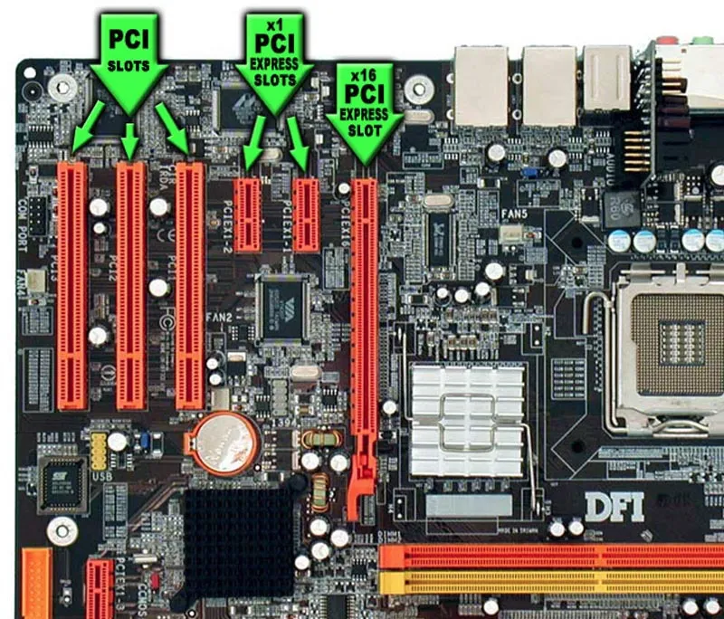

# UD 03.5 - Apuntes - Tarjetas de expansión

## 1. Introducción

Las **tarjetas de expansión** se insertan en las ranuras de expansión y permiten mejorar y añadir nuevas funciones al equipo. Su misión es comunicar dispositivos periféricos (internos y externos) con el sistema de bus del ordenador.

Las interfaces principales de expansión han sido **VESA**, **PCI**, **AGP** (estas tres, prácticamente obsoletas) y **PCI Express** (PCIe), y se instalan en el **slot** correspondiente.

Una vez insertadas en el ordenador, será necesaria su configuración en el sistema operativo mediante **controladores** o *drivers* y la instalación del software del fabricante. También existen tarjetas *plug-and-play*, que se configuran automáticamente con ayuda del sistema operativo.

Tarjetas de expansión más comunes:
* Tarjeta gráfica.
* Tarjeta de red: LAN o Wi-Fi.
* Tarjetas multimedia: sonido, captura de vídeo, captura de televisión, etc.

Además, es posible ampliar nuestro equipo con otras tarjetas como:
* Tarjetas de módem.
* Tarjetas de puertos USB.
* Tarjetas de puertos en serie o paralelo.
* Tarjetas controladoras de discos.
* Otras tarjetas adaptadoras (FireWire, entradas/salidas, específicas de dispositivos, etc.).

Debido al avance en la tecnología **USB** y a la **integración de audio/vídeo en la placa base**, hoy en día las tarjetas de expansión se emplean cada vez con menos frecuencia, integrándose en estos dispositivos todas las funcionalidades de las tarjetas de expansión convencionales.

### Ampliación sobre la evolución de los buses

El reemplazo de las interfaces **PCI** y **AGP** por **PCI Express** se debe a la necesidad de mayor ancho de banda y a un cambio fundamental en la arquitectura del bus:
* **PCI** y **AGP** operan como **buses paralelos**, limitando la frecuencia de reloj debido a problemas de *timing* y atenuación de la señal (*crosstalk*).
* **PCI Express** es un **bus serial** que utiliza carriles (*lanes*) bidireccionales de alta velocidad, lo que permite escalar el rendimiento de forma modular (x1, x4, x8, x16) y ofrece un ancho de banda significativamente mayor.

<figure markdown="span" align="center">
  { width="85%"  }
  <figcaption>Ejemplo de tarjetas de expansión típicas</figcaption>
</figure>

<figure markdown="span" align="center">
  { width="85%"  }
  <figcaption>Vista en detalle de diferentes tipos de tarjetas de expansión.</figcaption>
</figure>

---

## 2. Slot de expansión

Los **Slots** son ranuras de expansión de la placa base donde se insertan las tarjetas. Incorporan circuitos integrados para operar con diferentes periféricos o ampliar funcionalidades de un equipo.

### PCI (Peripheral Component Interconnect)

* Ancho de bus de **32 bits** o **64 bits** (a 33 MHz).
* Tasa de transferencia máxima de **133 MB/s** en el bus de 32 bits (33,33 MHz × 32 bits ÷ 8 bits/byte = 133 MB/s).
* Tasa de transferencia máxima de **266 MB/s** en el bus de 64 bits.
* Utiliza **3.3 V** o **5 V**, dependiendo del dispositivo.

<figure markdown="span" align="center">
  { width="85%"  }
  <figcaption>Ranura PCI en una placa base.</figcaption>
</figure>

### AGP (Accelerated Graphics Port)

Uso exclusivo para tarjetas gráficas. **Actualmente en desuso.**

* **Versión 4x**: tasa de transferencia máxima de **1 GB/s** (1.064 MB/s).
* **Versión 8x**: tasa de transferencia máxima de **2 GB/s** (2.132 MB/s).
* **Tensiones**:
    * 0.7 V o 1.5 V para la 8x.
    * 1.5 V o 3.3 V para la 4x.

<figure markdown="span" align="center">
  { width="85%"  }
  <figcaption>Ranura AGP, utilizada exclusivamente para tarjetas gráficas (en desuso).</figcaption>
</figure>

### PCI Express (PCI-E)

**PCI Express** es un bus seriado de datos de alta velocidad, cuya función es comunicar entre sí los diferentes componentes de *hardware* de un PC. Este bus comenzó a introducirse en 2003 como sustituto del bus PCI.

#### Versiones del bus PCIe desde su creación

Actualmente, se han desarrollado 6 versiones diferentes del bus PCIe:

| Versión | Año de Lanzamiento | Tasa de Transferencia (GT/s) | Ancho de Banda por Vía (MB/s) |
| :---: | :---: | :---: | :---: |
| **PCIe 1.0** | 2003 | 2.5 GT/s | 250 MB/s |
| **PCIe 2.0** | 2007 | 5 GT/s | 500 MB/s |
| **PCIe 3.0** | 2010 | 8 GT/s | 984.6 MB/s |
| **PCIe 4.0** | 2017 | 16 GT/s | 1,969 MB/s |
| **PCIe 5.0** | 2019 | 32 GT/s | 3,938 MB/s |
| **PCIe 6.0** | (Esperada 2021) | 64 GT/s | 7,877 MB/s |

*Nota: La columna "Ancho de Banda por Vía" hace referencia a la tasa de transferencia por carril (*lane*) en cada dirección.*

<figure markdown="span" align="center">
  { width="85%"  }
  <figcaption>Evolución de las versiones y tasas de transferencia del bus PCI Express.</figcaption>
</figure>

#### Modularidad del Bus PCIe

El bus PCIe es **modular**. Los conectores en la placa base pueden ser **x1**, **x4**, **x8** o **x16**, en función del número de vías de datos (carriles) PCIe conectados.

**Ampliación:** El rendimiento total se calcula multiplicando el ancho de banda por vía por el número de carriles. Por ejemplo, un *slot* PCIe 4.0 x16 ofrece un ancho de banda teórico de más de 31 GB/s en cada dirección.

<figure markdown="span" align="center">
  { width="85%"  }
  <figcaption>Conectores PCI Express con diferentes anchos de vía (x1, x4, x8, x16).</figcaption>
</figure>

<figure markdown="span" align="center">
  { width="85%"  }
  <figcaption>Distribución de los slots PCI Express en una placa base típica.</figcaption>
</figure>

### Factor de forma y brackets

Las tarjetas de expansión vienen preparadas para los diferentes factores de forma de las cajas de los equipos. Dependiendo del factor de forma, se debe utilizar un **bracket** de **perfil alto** o de **perfil bajo**.

<figure markdown="span" align="center">
  { width="85%"  }
  <figcaption>Comparativa de brackets de perfil alto y perfil bajo para tarjetas de expansión.</figcaption>
</figure>

---

## 3. Tarjetas gráficas

La **tarjeta gráfica**, también conocida como *tarjeta de vídeo*, *tarjeta aceleradora de gráficos* o *adaptador de pantalla*, es la responsable de mostrar texto, imágenes y gráficos en el monitor.

La mayoría de las tarjetas gráficas actuales están diseñadas para la ranura **PCI Express x16**.

<figure markdown="span" align="center">
  { width="85%"  }
  <figcaption>Ejemplo de una tarjeta gráfica dedicada con disipador y ventiladores.</figcaption>
</figure>

### 3.1. Componentes

Los componentes principales de una tarjeta gráfica son:
* **GPU (Graphics Processing Unit):** El procesador encargado de renderizar imágenes.
* **VRAM (Video Random Access Memory):** Memoria dedicada para datos de la imagen y texturas (ej. GDDR6).
* **RAMDAC (Random Access Memory Digital-to-Analog Converter):** Convertidor digital-analógico para salidas analógicas (VGA).
* **BIOS de la tarjeta (Firmware):** Contiene el código de arranque y configuración.
* **Salidas/Conectores:** Puertos para conectar el monitor.
* **Sistema de refrigeración:** Disipadores y/o ventiladores.

### 3.2. GPU y Arquitectura

La **GPU** es un microprocesador especializado en cálculos de coma flotante, lo que la hace excepcionalmente rápida para tareas altamente paralelizadas.

Los dos principales fabricantes son **NVIDIA** (**GeForce**) y **AMD** (**Radeon**).

**Ampliación:** La arquitectura moderna de las GPUs se basa en miles de **núcleos CUDA** (NVIDIA) o **Stream Processors** (AMD), esenciales para la rasterización y el *Ray Tracing* (trazado de rayos).

### 3.3. Interfaces con placa base

Las tarjetas gráficas se conectan a través de:
* **PCI Express x16:** Estándar actual.
* **AGP:** Obsoleto.
* **PCI:** Obsoleto.

### 3.4. Salidas/conectores de la tarjeta gráfica

Los conectores para monitores son:
* **VGA (Video Graphics Array):** Conector analógico de 15 pines.
* **DVI (Digital Video Interface):** Puede ser digital (DVI-D), analógico (DVI-A) o combinado (DVI-I).
* **HDMI (High-Definition Multimedia Interface):** Estándar digital que transmite vídeo y audio.
* **DisplayPort:** Estándar digital de alto ancho de banda, popular en monitores profesionales.
* **USB-C/Thunderbolt:** Para conectividad de vídeo de alta velocidad en tarjetas modernas.

### 3.5. Tarjetas gráficas integradas y dedicadas

| Tipo de Tarjeta | Descripción | Ventajas | Desventajas |
| :--- | :--- | :--- | :--- |
| **Integrada (iGPU)** | Forman parte del chip del procesador o *chipset*. Utilizan la RAM del sistema (memoria compartida). | Bajo consumo y coste. | Bajo rendimiento, comparte memoria con la CPU. |
| **Dedicada (dGPU)** | Tarjeta independiente con su propia GPU y VRAM. | Máximo rendimiento gráfico. | Mayor coste y consumo energético. |

### 3.6. SLI/Crossfire

Sistemas para usar dos o más tarjetas gráficas en paralelo y aumentar el rendimiento:
* **SLI (Scalable Link Interface):** Tecnología de **NVIDIA**.
* **Crossfire:** Tecnología de **AMD**.

### 3.7. Refrigeración

Los sistemas de refrigeración más comunes son:
* **Refrigeración activa:** Disipador de calor y ventiladores (el más común).
* **Refrigeración pasiva:** Solo utiliza un gran disipador (*heat pipes*) para funcionamiento silencioso.
* **Refrigeración líquida:** Utiliza un bloque de agua y un radiador externo (máxima eficiencia).

### 3.8. Alimentación

Las tarjetas de baja gama se alimentan del *slot* PCIe (hasta 75W). Las tarjetas potentes requieren conectores de alimentación adicionales (directamente de la fuente) de **6 pines** o **8 pines**.

### 3.9. Multimonitor

La mayoría de las tarjetas gráficas modernas permiten conectar y gestionar la visualización en múltiples monitores simultáneamente.

---

## 4. Tarjetas de red

La **Tarjeta de Interfaz de Red (NIC)** es el dispositivo que permite al ordenador conectarse a una red. Cada tarjeta tiene una **dirección MAC** única.

### 4.1. Tarjeta para redes cableadas

Utilizan el estándar **Ethernet** y se conectan a través de un conector **RJ-45**.
* **Velocidades comunes:** 10/100 Mbps, 1 Gbps y 10 Gbps.
* Están, en su mayoría, integradas en la placa base (*LAN on Motherboard* - LOM).

### 4.2. Tarjeta para redes Wifi

Permiten la conexión inalámbrica mediante antenas y señales de radiofrecuencia (RF).
* Los estándares más comunes son los de la familia **IEEE 802.11** (a, b, g, n, ac, ax/Wi-Fi 6).
* Pueden ser tarjetas PCIe o módulos **M.2** internos.

---

## 5. Tarjeta de sonido

La tarjeta de sonido o placa de audio gestiona la entrada y salida de audio.

### 5.1. Canales y polifonía

* **Canales:** Número de señales de audio que puede manejar (ej. sistema **5.1**).
* **Polifonía:** Número de sonidos diferentes que la tarjeta puede reproducir al mismo tiempo.

### 5.2. Operaciones básicas

La tarjeta de sonido realiza dos operaciones fundamentales:
1.  **Reproducción (DAC):** Convierte la señal digital a analógica para altavoces (Conversor Digital-Analógico).
2.  **Grabación (ADC):** Convierte la señal analógica (del micrófono) a digital (Conversor Analógico-Digital).

### 5.3. Componentes

* **Chip de sonido (DSP):** Procesador de señal digital, que realiza las funciones DAC y ADC.
* **Conexión con la placa base:** Generalmente PCIe (o integrada en la placa base como *Audio Codec*).
* **Controladores MIDI:** Permiten conectar instrumentos musicales digitales (en tarjetas profesionales).

### 5.4. Salidas

Los conectores más comunes, identificados por colores según el estándar **PC 99**, son:
* **Rosa:** Entrada de micrófono.
* **Azul claro:** Entrada de línea.
* **Verde claro:** Salida de línea para altavoces o auriculares (principal).
* **Negro:** Salida para altavoces traseros.
* **Gris:** Salida para altavoces laterales.
* **Naranja:** Salida para el altavoz central y *subwoofer*.

**Ampliación:** Las tarjetas modernas incluyen **salidas ópticas (Toslink) y coaxiales** para audio digital, y muchos usuarios optan por interfaces externas **USB (DAC)** para evitar la interferencia interna.

---

## 6. Tarjetas de interfaz

Se utilizan para añadir o expandir puertos de conectividad no presentes en la placa base.

Ejemplos:
* Controladoras de discos (SATA/NVMe).
* Tarjetas con puertos USB 3.0/3.1/3.2/4.0.
* Tarjetas FireWire (IEEE 1394).
* Tarjetas serie/paralelo.

---

## 7. Tarjetas capturadoras de vídeo

Permiten grabar una señal de vídeo de una fuente externa (cámara, consola, TV) y almacenarla en el ordenador.

* **Capturadoras de TV:** Permiten ver y grabar programas de televisión.
* **Capturadoras de vídeo:** Utilizadas en *streaming* o edición para capturar la señal de una fuente de vídeo de alta definición (HDMI, DisplayPort, SDI).